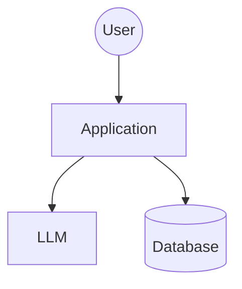

# Threat Model: [System Name]

*Post-session artefact template for AI, LLM and agentic systems*

---

## How to use this template

This is the artefact a team produces after running a threat modelling session using the facilitator runbook. It is designed to live in a repository alongside the code it describes, be versioned in git, be readable by someone who was not in the original session, and be the single source of truth for "what did we decide about security and privacy for this system".

**Fill it in during or immediately after the session**, not a week later. The value decays fast and memory of why a decision was made fades even faster.

Italicised text in square brackets like *[fill this in]* is instructional and should be deleted before the document is considered complete. Example entries are marked *[example]* and should be replaced with your own content.

This template should be used alongside:

- *Threat Modelling AI, LLM and Agentic Systems* — the reference document covering the underlying frameworks.
- *AI / LLM / Agentic Threat Modelling Runbook* — the facilitator guide for running the session that produced this artefact.

**Note to the reader:** if you are reading a completed version of this template and something is unclear, the person to ask is the facilitator named in the metadata below. If that person no longer has context, the threat model is stale and needs a new session.

---

## 1. Metadata

| Field | Value |
|---|---|
| System name | *[e.g. DevAssist]* |
| System owner | *[named individual, not a team]* |
| Threat model version | *[e.g. 1.0]* |
| Session date | *[YYYY-MM-DD]* |
| Facilitator | *[named individual]* |
| Attendees | *[list everyone who was in the room, with role]* |
| Lifecycle stage | *[greenfield design / pre-launch review / post-launch refresh / incident response]* |
| Next review trigger | *[specific event or date]* |
| Status | *[draft / signed off / superseded]* |
| Supersedes | *[previous version if applicable]* |

---

## 2. Executive summary

*[Two to four paragraphs for stakeholders who will not read the rest of this document. Cover: what the system does, the highest-severity threats identified, the key design decisions made in the session, and any unresolved blockers. Write this last, after the rest of the document is complete.]*

**Highest-severity threats identified:** *[three to five, with IDs]*

**Key design decisions made:** *[three to five bullet points]*

**Unresolved blockers:** *[anything that must be resolved before ship, with owner and deadline]*

**Accepted risks requiring sign-off:** *[list, with named accepting party]*

---

## 3. What are we working on?

### 3.1 System description

*[One paragraph, written in plain English by someone who will build the system. What does it do, who uses it, what value does it provide? No marketing language, no architecture jargon.]*

### 3.2 Data flow diagram

*[Insert the DFD here. For markdown-native storage, a mermaid diagram is ideal because it versions cleanly in git. An image is acceptable but make sure the source file is also committed. The DFD must include every actor, every data store, every external service, and every trust boundary as a dashed line.]*

### 3.3 Assets

*[List everything that is at risk if the system is compromised. Be concrete.]*

| Asset | Sensitivity | Notes |
|---|---|---|
| *[e.g. Customer PII in incident logs]* | *[Personal / Special-category / Internal / Public]* | *[Any relevant context]* |
| | | |
| | | |

### 3.4 Actors

*[Everyone who interacts with the system, including attackers and unintentional insiders.]*

| Actor | Type | Privileges | Notes |
|---|---|---|---|
| *[e.g. Engineer]* | *[Legitimate user]* | *[Read internal repos, post PRs]* | *[Varies by team]* |
| *[e.g. Hosted LLM vendor]* | *[Third party]* | *[Sees every prompt]* | *[Governed by DPA signed YYYY-MM-DD]* |
| *[e.g. External attacker]* | *[Threat actor]* | *[None by default]* | *[Possible entry points: Jira tickets, RAG sources]* |
| | | | |

### 3.5 Trust boundaries

*[Every dashed line on the DFD gets an entry here. Name the boundary, what it separates, and what is assumed about each side.]*

| Boundary | Separates | Assumption on trusted side | Assumption on untrusted side |
|---|---|---|---|
| *[e.g. RAG content boundary]* | *[Agent ↔ Confluence corpus]* | *[Agent will act on content]* | *[Content may be authored or edited by anyone with Confluence access, including contractors]* |
| | | | |

### 3.6 Data classifications

*[What data classes flow through this system, and which flows carry which classes?]*

- [ ] Public
- [ ] Internal confidential
- [ ] Personal data under GDPR
- [ ] Special-category personal data (Article 9)
- [ ] Secrets and credentials
- [ ] Other: *[specify]*

**Highest classification present:** *[fill in]*

**Regulatory regimes applicable:** *[GDPR / EU AI Act tier / sector-specific: HIPAA / PCI DSS / NIS2 / other]*

### 3.7 AI-specific system characteristics

*[These are the questions a generic threat model would miss. Answer every one or mark explicitly as "not applicable and here is why".]*

| Question | Answer |
|---|---|
| Foundation model(s) in use | *[name, vendor, hosting arrangement]* |
| Fine-tunes or adapters | *[list or "none"]* |
| RAG pipeline? | *[Yes/No. If yes: what is indexed, refresh cadence, source access control]* |
| Long-term memory? | *[Yes/No. If yes: partitioning strategy, write controls]* |
| MCP servers or plugins installed | *[list by name, or "none"]* |
| Agentic (multiple agents, autonomous tool use)? | *[Yes/No. If yes: orchestration pattern, inter-agent trust]* |
| Tools and actions with side effects | *[list every one]* |
| Typical session length | *[turns / tokens / wall clock]* |
| Maximum realistic session length | *[for context rot analysis]* |

---

## 4. What can go wrong?

### 4.1 Threat register

*[One row per threat identified in the session. IDs should be unique within this document and traceable. Use the format TM-[system]-[number], e.g. TM-DEVASSIST-001. Every threat should be traceable to a component on the DFD and have a system-specific example, not a generic "an attacker could" sentence.]*

| ID | Category | Title | Example (system-specific) | DFD component(s) | Likelihood | Impact | Status |
|---|---|---|---|---|---|---|---|
| *[TM-XXX-001]* | *[LLM01]* | *[Indirect prompt injection via RAG]* | *[A Confluence page edited by a former contractor contains hidden instructions that cause the docs writer agent to post internal postmortems to a public Slack channel when the page is summarised.]* | *[Orchestrator, RAG, Slack MCP]* | *[Medium]* | *[High]* | *[Open / Mitigated / Accepted / Transferred / Avoided]* |
| | | | | | | | |
| | | | | | | | |

*[Add as many rows as needed. Aim for completeness over elegance. Threats that were considered and rejected should also be captured, marked as "Rejected" in the Status column with a brief rationale, so reviewers can see what was considered.]*

### 4.2 Threats by lens

*[Confirm that each of the four lenses from the runbook has been applied. Tick the box and note which threat IDs came from each lens. If a lens produced no threats, justify.]*

#### Adversarial (OWASP LLM Top 10 and Agentic Top 10)

- [ ] **LLM01 Prompt Injection** — IDs: *[list]*
- [ ] **LLM02 Sensitive Information Disclosure** — IDs: *[list]*
- [ ] **LLM03 Supply Chain** — IDs: *[list]*
- [ ] **LLM04 Data and Model Poisoning** — IDs: *[list]*
- [ ] **LLM05 Improper Output Handling** — IDs: *[list]*
- [ ] **LLM06 Excessive Agency** — IDs: *[list]*
- [ ] **LLM07 System Prompt Leakage** — IDs: *[list]*
- [ ] **LLM08 Vector and Embedding Weaknesses** — IDs: *[list or N/A]*
- [ ] **LLM09 Misinformation** — IDs: *[list]*
- [ ] **LLM10 Unbounded Consumption** — IDs: *[list]*
- [ ] **ASI01 Agent Goal Hijack** — IDs: *[list or N/A if not agentic]*
- [ ] **ASI02 Tool Misuse and Exploitation** — IDs: *[list]*
- [ ] **ASI03 Identity and Privilege Abuse** — IDs: *[list]*
- [ ] **ASI04 Agentic Supply Chain** — IDs: *[list]*
- [ ] **ASI05 Unexpected Code Execution** — IDs: *[list]*
- [ ] **ASI06 Memory and Context Poisoning** — IDs: *[list]*
- [ ] **ASI07 Inter-Agent Communication Exploitation** — IDs: *[list]*
- [ ] **ASI08 Cascading Failures** — IDs: *[list]*
- [ ] **ASI09 Human-Agent Trust Exploitation** — IDs: *[list]*
- [ ] **ASI10 Rogue Agents** — IDs: *[list]*

#### Structural hazards

- [ ] **Context rot** — IDs: *[list]*
- [ ] **Hallucination (structural)** — IDs: *[list]*
- [ ] **Transferable decision boundaries** — IDs: *[list or "acknowledged as assumed-broken control, see mitigation X"]*
- [ ] **Decision-boundary probing attacks** — IDs: *[list or "acknowledged, deterministic gate downstream of classifier"]*
- [ ] **Geometry-aware attacks on non-Euclidean models** — IDs: *[list or N/A if Euclidean only]*
- [ ] **Angular-margin attacks** — IDs: *[list or N/A if no biometric or cosine-similarity matching used]*
- [ ] **Geometric adversarial attacks (boundary probing, AGSM, angular-margin)** — IDs: *[list or N/A]*
- [ ] **Adversarial subspace problem** — IDs: *[list or "acknowledged; structural enforcement downstream of all model decisions confirmed in mitigation matrix"]*

#### Privacy (LINDDUN, T.R.I.M., GDPR)

- [ ] **LINDDUN Linking** — IDs: *[list]*
- [ ] **LINDDUN Identifying** — IDs: *[list]*
- [ ] **LINDDUN Non-repudiation** — IDs: *[list]*
- [ ] **LINDDUN Detecting** — IDs: *[list]*
- [ ] **LINDDUN Data Disclosure** — IDs: *[list]*
- [ ] **LINDDUN Unawareness/Unintervenability** — IDs: *[list]*
- [ ] **LINDDUN Non-compliance** — IDs: *[list]*
- [ ] **T.R.I.M. Transfer** — IDs: *[list]*
- [ ] **T.R.I.M. Retention/Removal** — IDs: *[list]*
- [ ] **T.R.I.M. Inference** — IDs: *[list]*
- [ ] **T.R.I.M. Minimisation (input and output)** — IDs: *[list]*
- [ ] **GDPR Article 5 principles walked** — Notes: *[which principles engaged, and how]*
- [ ] **GDPR Article 16/17 executability verified** — Notes: *[can you actually rectify and erase?]*
- [ ] **GDPR Article 22 applicability assessed** — Notes: *[automated decision making with legal effect?]*
- [ ] **EU AI Act risk tier determined** — Tier: *[minimal / limited / high / prohibited / GPAI]*

#### MCP-specific

*[If the system has MCP servers or equivalent plugins, complete one seven-question review per server. Skip if not applicable.]*

**Server name:** *[e.g. community-utilities-mcp]*

| Question | Answer | Pass/Fail |
|---|---|---|
| Provenance — who wrote it, how was it installed, is the version pinned, has anyone read the source? | | |
| Process isolation — where does it run, as whom, what can it read, what network egress? | | |
| Credential scope — what identities and tokens does it hold, are they scoped? | | |
| Tool surface — what tools, read descriptions adversarially | | |
| Cross-server exposure — what data could flow through it via the model? | | |
| Update model — how updated, re-reviewed on update? | | |
| Observability and kill switch — logged, killable in under five minutes? | | |

*[Repeat for each server. Any server failing three or more questions should be a blocker.]*

---

## 5. What are we going to do about it?

### 5.1 Mitigation matrix

*[One row per threat from Section 4.1. Every threat must have a decision: Mitigate, Accept, Transfer, or Avoid. Every "Mitigate" has a primary control, a backstop, an owner, and a deadline. Every "Accept" has named sign-off at the appropriate level.]*

| Threat ID | Decision | Primary mitigation | Backstop | Owner | Deadline | Sign-off (if accepted) |
|---|---|---|---|---|---|---|
| *[TM-XXX-001]* | *[Mitigate]* | *[Spotlighting on retrieved content + allow-list on Slack MCP post_message target channels]* | *[Output filter for personal data]* | *[Named person]* | *[YYYY-MM-DD]* | *[N/A]* |
| | | | | | | |
| | | | | | | |

### 5.2 Structural-first test

*[For each "Mitigate" decision, the primary mitigation should be as far left in the architecture as possible. Count the decisions where the primary mitigation is structural (design-time) versus runtime. If runtime mitigations dominate, the design needs revisiting.]*

- Design-time structural mitigations: *[count]*
- Runtime mitigations as primary: *[count]*
- Ratio acceptable? *[Yes/No, with rationale]*
- Statistical defences (pattern-matching guardrails, prompt blocklists) used as *primary* mitigations: *[count]*
- If this count is non-zero, flag as a subspace-problem design smell and justify each in Section 5.3.

### 5.3 Accepted risks register

*[Every "Accept" decision from the matrix, broken out here with the explicit rationale and named sign-off. Accepted risks without named sign-off are not accepted, they are unresolved.]*

| Threat ID | Rationale for acceptance | Accepting party | Sign-off date | Review date |
|---|---|---|---|---|
| *[TM-XXX-007]* | *[Mitigation cost exceeds expected loss; compensating controls in place at the application boundary]* | *[Head of Engineering]* | *[YYYY-MM-DD]* | *[YYYY-MM-DD]* |
| | | | | |

### 5.4 Blockers

*[Anything that must be resolved before the system ships or before the next milestone. Be specific about what "resolved" means.]*

| Blocker | Why it blocks | Owner | Target resolution date |
|---|---|---|---|
| *[Community utilities MCP server failed five of seven review questions]* | *[Unsandboxed third-party code with full host credentials is not acceptable for production]* | *[Named person]* | *[YYYY-MM-DD]* |
| | | | |

### 5.5 Categories of mitigation applied

*[Confirmation that the major mitigation categories from the runbook have been considered. Tick and reference specific mitigation IDs from Section 5.1.]*

#### Design-time structural controls

- [ ] Least agency applied per agent and per tool
- [ ] Per-agent scoped credentials (no shared service accounts)
- [ ] Authorisation enforced at the data layer
- [ ] All retrieved content treated as untrusted (spotlighting)
- [ ] Code execution sandboxed with no network/filesystem by default
- [ ] MCP isolation: per-server sandbox, scoped credentials, reviewed tool descriptions
- [ ] Input minimisation on prompts
- [ ] Output minimisation on responses
- [ ] Out-of-band confirmation required for destructive or irreversible actions
- [ ] Data-flow policy between MCP servers

#### Runtime controls

- [ ] Rate and cost limits per user, per agent, per tool
- [ ] Hard caps on agent loop iterations
- [ ] Circuit breakers between agents
- [ ] Periodic re-injection of critical instructions (context rot mitigation)
- [ ] Fresh sessions mandated for high-stakes operations
- [ ] Output filters for PII, secrets, and exfiltration patterns
- [ ] Observability: every tool call, every retrieval, every memory write, every agent message logged with tool description version
- [ ] Agent inventory with centralised kill switch

#### Privacy-specific controls

- [ ] Refuse or ground on personal-data queries
- [ ] Rectification capability demonstrable (Article 16)
- [ ] Removal capability demonstrable (Article 17)
- [ ] Data classification tags travel with data through the system
- [ ] DPIA completed
- [ ] Privacy notice updated to cover this processing

#### Process controls

- [ ] MCP server review gate (install and update)
- [ ] AI-BOM maintained
- [ ] Incident response playbook covers AI-specific scenarios
- [ ] Regular review cadence agreed

---

## 6. Did we do a good enough job?

### 6.1 Evidence checklist

*[Tick each item or mark N/A with explanation. A "good enough" threat model ticks all applicable items.]*

#### Question 1 — What are we working on?

- [ ] DFD reflects the system as it will actually ship, not an aspirational version
- [ ] Trust boundaries drawn explicitly (not implied)
- [ ] Assets, actors, and data classifications named
- [ ] AI-specific characteristics documented (Section 3.7)
- [ ] Architect and senior engineer agree the diagram is correct

#### Question 2 — What can go wrong?

- [ ] Every threat traceable to a DFD component
- [ ] Every threat has a system-specific example, not a generic one
- [ ] All four lenses applied where relevant (adversarial, structural, privacy, MCP)
- [ ] Rejected threats captured alongside accepted ones (to show walked surface)
- [ ] Structural hazards explicitly considered (context rot, hallucination, transferability)

#### Question 3 — What are we going to do about it?

- [ ] Every threat has a decision (Mitigate / Accept / Transfer / Avoid)
- [ ] Every mitigation has owner and deadline
- [ ] Every accepted risk has named sign-off
- [ ] Structural-first test applied
- [ ] Traceability matrix complete

#### Question 4 — Did we do a good enough job?

- [ ] Threat model is versioned
- [ ] Next review trigger agreed and recorded
- [ ] External reviewer scheduled or completed
- [ ] At least one design decision changed as a result of this session

### 6.2 Manifesto values check

*[Ask these out loud at the end of the session and record honest answers.]*

| Question | Answer |
|---|---|
| Did we change the design, or are we producing a document? | |
| Did the people who will build this participate and argue? | |
| Do we understand the threats better than at the start? | |
| Have we produced owners, deadlines, and design changes? | |
| Do we have a plan for the next review? | |

### 6.3 Design changes made as a result of this session

*[List concrete design decisions that changed because of the threat modelling work. If this list is empty, the session was theatre and this artefact should be marked as such.]*

1. *[e.g. Community utilities MCP server removed from production deployment pending source review]*
2. *[e.g. Per-agent GitHub tokens replaced shared service account, scoped to repo:read + pull_request:write]*
3. *[e.g. Long-term memory partitioned per engineer with cryptographic isolation]*
4.
5.

### 6.4 Residual risk summary

*[Plain-English summary of the risk posture after all mitigations are applied and accepted risks are acknowledged. Written for a non-technical stakeholder.]*

*[e.g. After mitigations, the primary residual risks are (1) indirect prompt injection via historical RAG content that cannot be fully audited, partially mitigated by spotlighting and destructive-action confirmation; (2) cost overrun from bugs in agent loops, mitigated by hard caps but not eliminated; (3) hallucinated personal data about employees, mitigated by refusal-to-ground on personal queries but not eliminated. The Head of Engineering has accepted these risks on [date] with a review scheduled for [date].]*

---

## 7. Review and maintenance

### 7.1 Next review

| Field | Value |
|---|---|
| Trigger | *[specific event: feature launch / new MCP server / dependency change / quarterly date / incident affecting similar systems]* |
| Scheduled date | *[YYYY-MM-DD]* |
| Responsible facilitator | *[named person]* |

### 7.2 Review triggers

*[Tick all that apply. Any of these firing means this threat model needs a refresh before the scheduled date.]*

- [ ] New feature added that touches any component on the DFD
- [ ] New MCP server or plugin installed
- [ ] New agent added to the system
- [ ] Foundation model changed or upgraded
- [ ] New data source added to RAG or memory
- [ ] Change in credential scope for any agent
- [ ] Security incident affecting this or a similar system
- [ ] Regulatory change (GDPR guidance, AI Act update, sector-specific)
- [ ] Quarterly cadence reached

### 7.3 Change log

*[Every update to this document gets a row. Keep the list chronological.]*

| Version | Date | Author | Summary of changes |
|---|---|---|---|
| 1.0 | *[YYYY-MM-DD]* | *[name]* | *[Initial version from session on date]* |
| | | | |

---

## 8. Appendices

### 8.1 References and frameworks used

- OWASP Top 10 for LLM Applications 2025
- OWASP Top 10 for Agentic Applications 2026 (ASI01–ASI10)
- OWASP Practical Guide for Secure MCP Server Development
- OWASP Practical Guide for Securely Using Third-Party MCP Servers
- LINDDUN privacy threat modelling framework
- F-Secure Elevation of Privacy (T.R.I.M.)
- GDPR Articles 5, 9, 16, 17, 22
- EU AI Act (relevant tier provisions)
- Threat Modeling Manifesto
- Tramèr et al., "The Space of Transferable Adversarial Examples" (arXiv:1704.03453, 2017)
- Chroma, "Context Rot: How Increasing Input Tokens Impacts LLM Performance" (2025)

### 8.2 Sign-off

| Role | Name | Signature / approval | Date |
|---|---|---|---|
| System owner | | | |
| Security lead | | | |
| Privacy lead (if applicable) | | | |
| Engineering lead | | | |
| Head of Engineering (for accepted risks) | | | |

### 8.3 Distribution

*[Who has this document been shared with and when?]*

| Recipient | Date | Purpose |
|---|---|---|
| | | |

---

## Notes for the person filling this in

A few practical points worth keeping in mind as you complete this template:

**Do not leave italicised placeholders in a finished version.** Anything in square brackets is either an instruction to you or an example, and both should be replaced or deleted before the document is considered complete. A signed-off threat model containing *[fill this in]* is a signed-off threat model that nobody actually read.

**The threat IDs matter.** Use a consistent naming scheme from the start: TM-[system abbreviation]-[sequential number] is fine. IDs become the lingua franca between this document, your backlog, and your incident response process. Do not renumber threats between versions; if a threat is removed, mark it as such and leave the ID retired.

**The mitigation matrix is the operational artefact.** Most of this document is context; the matrix is what the team actually works from. Keep it current even if the rest of the document goes stale. If the matrix says mitigation X is owned by person Y with deadline Z, that row should be trackable in whatever system you manage work in.

**Capture rejected threats, not just accepted ones.** A threat model that only lists confirmed threats tells a reviewer nothing about the surface you walked. Including the rejected threats with a brief rationale gives the reviewer confidence that you considered the possibility and chose not to treat it.

**Residual risk summary is for executives.** It is the one section in this document that a non-technical stakeholder will read. Write it accordingly: plain English, no jargon, honest about what remains unresolved. If you find yourself hedging, the accepted risks section is probably dodging something.

**This document is alive or it is dead.** A threat model that has not been updated in six months is not a threat model, it is a historical artefact. Set the next review trigger, honour it, and version the updates. The whole point of threat modelling as a continuous practice, as the Manifesto reminds us, is that a single snapshot is not enough.

### Final thoughts

A filled-in template is not the same as a good threat model. A good threat model is one where the filling-in process changed the design for the better. If you finished this document and the system is identical to what was proposed before the session, one of three things happened: the system was already perfect (it was not), the session was theatre (more likely), or the decisions made in the room are not actually being implemented (most likely).

The template is a scaffold. The value is in the conversations, the arguments, and the decisions the scaffold holds up. Keep the conversations honest, the arguments productive, and the decisions traceable, and the document will take care of itself.

Happy threat modelling.

---

*Tags: threat-modelling, template, post-session, AI-security, LLM, agentic-AI, MCP, LINDDUN, T.R.I.M., Threat-Modeling-Manifesto*
